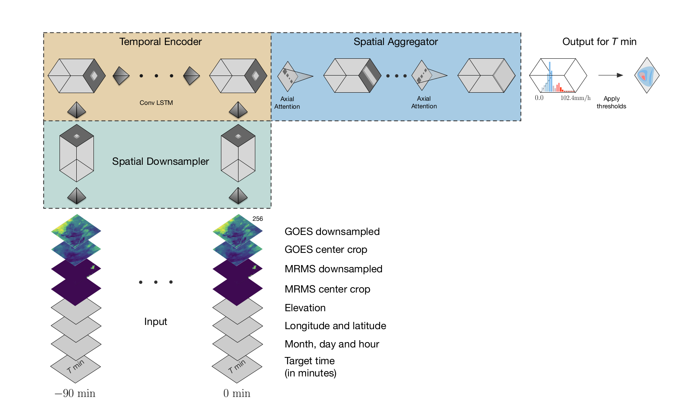

# MetNet Pytorch


This repo implements my own approximation of [MetNet](https://arxiv.org/abs/2003.12140).


Take a look at the notebooks, you can install this repo using:

```bash
pip install -e .
```

```python
from fastai.vision.all import *
from metnet_pytorch.model import DownSampler, MetNet
```

Define the MetNet params:

```python
past_instants = 6
horizon = 10
xtra_features = 5
image_encoder = DownSampler(3 + xtra_features + horizon)
```

```python
metnet = MetNet(image_encoder, hidden_dim=128, 
                ks=3, n_layers=1, horizon=horizon, 
                head=create_head(128, 1), n_feats=xtra_features, debug=True)
metnet.eval();
```

```python
imgs = torch.rand(1,past_instants,3,64,64)
timeseries = torch.rand(1,xtra_features,past_instants)
```

```python
with torch.no_grad():
    metnet(imgs, timeseries)
```

     Input -> (imgs: torch.Size([1, 6, 3, 64, 64]), feats: torch.Size([1, 5, 6]))
     augmented imgs:   torch.Size([1, 6, 8, 64, 64])
    Encode Timestep:(i=0)
     input shape: torch.Size([1, 6, 8, 64, 64])
     CondTime->x.shape: torch.Size([1, 6, 18, 64, 64])
     encoded images shape: torch.Size([1, 6, 256, 16, 16])
     temp_enc out shape: torch.Size([1, 128, 16, 16])
    Encode Timestep:(i=1)
     input shape: torch.Size([1, 6, 8, 64, 64])
     CondTime->x.shape: torch.Size([1, 6, 18, 64, 64])
     encoded images shape: torch.Size([1, 6, 256, 16, 16])
     temp_enc out shape: torch.Size([1, 128, 16, 16])
    Encode Timestep:(i=2)
     input shape: torch.Size([1, 6, 8, 64, 64])
     CondTime->x.shape: torch.Size([1, 6, 18, 64, 64])
     encoded images shape: torch.Size([1, 6, 256, 16, 16])
     temp_enc out shape: torch.Size([1, 128, 16, 16])
    Encode Timestep:(i=3)
     input shape: torch.Size([1, 6, 8, 64, 64])
     CondTime->x.shape: torch.Size([1, 6, 18, 64, 64])
     encoded images shape: torch.Size([1, 6, 256, 16, 16])
     temp_enc out shape: torch.Size([1, 128, 16, 16])
    Encode Timestep:(i=4)
     input shape: torch.Size([1, 6, 8, 64, 64])
     CondTime->x.shape: torch.Size([1, 6, 18, 64, 64])
     encoded images shape: torch.Size([1, 6, 256, 16, 16])
     temp_enc out shape: torch.Size([1, 128, 16, 16])
    Encode Timestep:(i=5)
     input shape: torch.Size([1, 6, 8, 64, 64])
     CondTime->x.shape: torch.Size([1, 6, 18, 64, 64])
     encoded images shape: torch.Size([1, 6, 256, 16, 16])
     temp_enc out shape: torch.Size([1, 128, 16, 16])
    Encode Timestep:(i=6)
     input shape: torch.Size([1, 6, 8, 64, 64])
     CondTime->x.shape: torch.Size([1, 6, 18, 64, 64])
     encoded images shape: torch.Size([1, 6, 256, 16, 16])
     temp_enc out shape: torch.Size([1, 128, 16, 16])
    Encode Timestep:(i=7)
     input shape: torch.Size([1, 6, 8, 64, 64])
     CondTime->x.shape: torch.Size([1, 6, 18, 64, 64])
     encoded images shape: torch.Size([1, 6, 256, 16, 16])
     temp_enc out shape: torch.Size([1, 128, 16, 16])
    Encode Timestep:(i=8)
     input shape: torch.Size([1, 6, 8, 64, 64])
     CondTime->x.shape: torch.Size([1, 6, 18, 64, 64])
     encoded images shape: torch.Size([1, 6, 256, 16, 16])
     temp_enc out shape: torch.Size([1, 128, 16, 16])
    Encode Timestep:(i=9)
     input shape: torch.Size([1, 6, 8, 64, 64])
     CondTime->x.shape: torch.Size([1, 6, 18, 64, 64])
     encoded images shape: torch.Size([1, 6, 256, 16, 16])
     temp_enc out shape: torch.Size([1, 128, 16, 16])
    res.shape=torch.Size([10])

